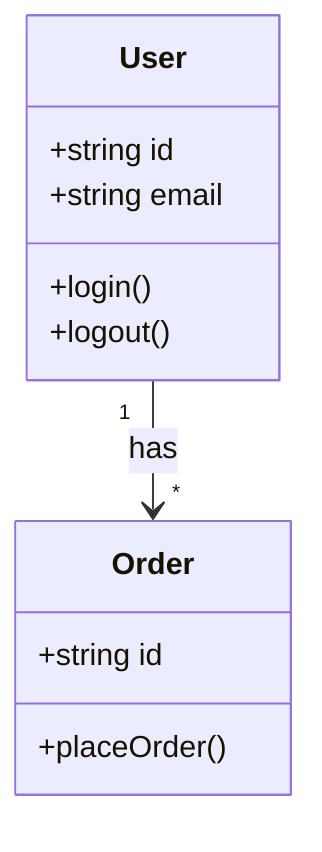
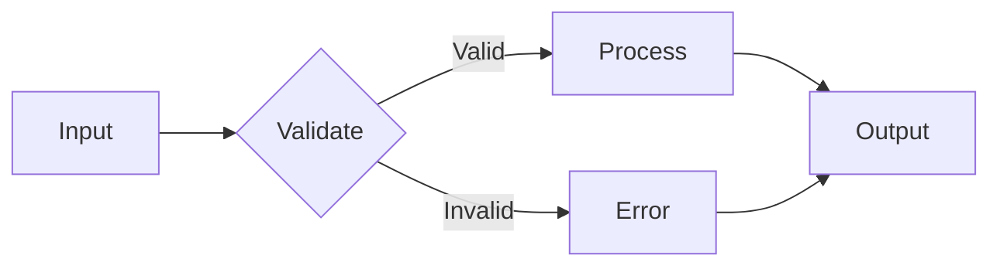
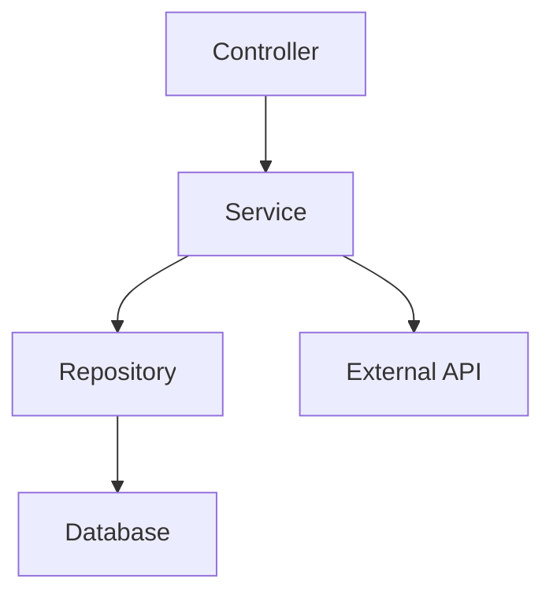
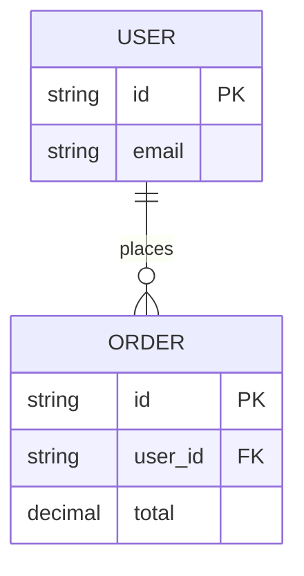

# /diagram — Quick Code Diagrams

Generate focused diagrams for specific code relationships.

## Quick Types

| Command | Diagram | Example |
|---------|---------|---------|
| `/diagram class [file]` | Class hierarchy | `/diagram class src/models/User.ts` |
| `/diagram flow [function]` | Control flow | `/diagram flow authMiddleware` |
| `/diagram deps [module]` | Dependencies | `/diagram deps api/users` |
| `/diagram er [models]` | Entity relations | `/diagram er User,Order,Product` |

## Class Diagram

For TypeScript/JavaScript classes:



## Flow Diagram

For function logic:



## Dependency Diagram

For module relationships:



## ER Diagram

For database entities:



## Usage Examples

```
/diagram class src/services/AuthService.ts
→ Generates class diagram showing AuthService and its dependencies

/diagram flow handleUserRegistration
→ Generates flowchart of the registration process

/diagram deps src/api/routes
→ Generates dependency graph of all API routes

/diagram er User,Profile,Settings
→ Generates ER diagram for user-related entities
```

## Output

Diagrams saved to:
- `docs/diagrams/class-[name].md`
- `docs/diagrams/flow-[name].md`
- `docs/diagrams/deps-[name].md`
- `docs/diagrams/er-[name].md`

Or inline in chat for quick review.
