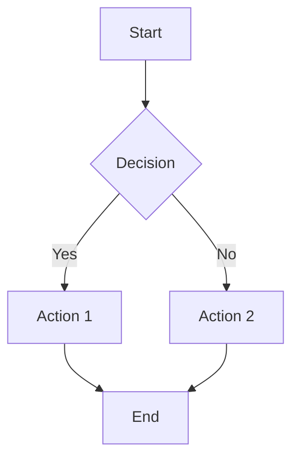

# /visualize — Visual Canvas Generation

Generate visual diagrams and Canvas artifacts for code visualization and analysis.

## When to Use

Use `/visualize` when you need:
- Architecture diagrams for documentation
- Data flow visualization
- Decision trees or flowcharts
- System topology maps
- ER diagrams
- Sequence diagrams

## Canvas Integration

Cursor Canvas allows creating visual artifacts that persist alongside code.

### Supported Diagram Types

| Type | Format | Use For |
|------|--------|---------|
| **Architecture** | Mermaid | System overview |
| **Flowchart** | Mermaid | Process flows |
| **Sequence** | Mermaid | Interaction diagrams |
| **ER** | Mermaid | Database schema |
| **State** | Mermaid | State machines |
| **Gantt** | Mermaid | Project timelines |
| **Pie** | Mermaid | Statistics |
| **Mindmap** | Mermaid | Concept mapping |

## Steps

### 1. Analyze Request

Determine:
- What needs to be visualized?
- Who is the audience?
- What level of detail?

### 2. Generate Diagram

Create using Mermaid syntax:



### 3. Create Canvas File

Save to `docs/canvas/` or project root:

```markdown
# Architecture Overview

## System Components

\`\`\`mermaid
[diagram code]
\`\`\`

## Description
[Context and explanation]

## Last Updated
YYYY-MM-DD
```

## Output Format

```markdown
## Visualization Generated

### Canvas Created
| File | Type | Location |
|------|------|----------|
| `docs/canvas/architecture.md` | Mermaid | Project docs |

### Diagrams Included
1. **Architecture Overview** - High-level system design
2. **Data Flow** - Request/response flow
3. **Component Interaction** - Service dependencies

### Usage
- View in Cursor: Open file, preview Mermaid
- Export: Use Mermaid Live Editor for PNG/SVG
```

## Best Practices

1. **Keep diagrams current** - Update when code changes
2. **Multiple levels** - High-level + detailed views
3. **Color coding** - Different colors for different services
4. **Labels** - Clear, concise labels
5. **Legend** - Explain symbols and colors

## Integration with Other Commands

- After `/paradigm-init` - Generate initial architecture
- With `/review-hooks` - Visualize hook flow
- With `/paradigm-adopt` - Document current vs target state

## Canvas Storage

Recommended structure:
```
docs/
├── canvas/
│   ├── architecture.md
│   ├── data-flow.md
│   ├── er-diagram.md
│   └── decision-log.md
```

## External Tools

- **Mermaid Live Editor**: https://mermaid.live
- **Export to**: PNG, SVG, PDF
- **Embed in**: GitHub, Notion, Confluence
